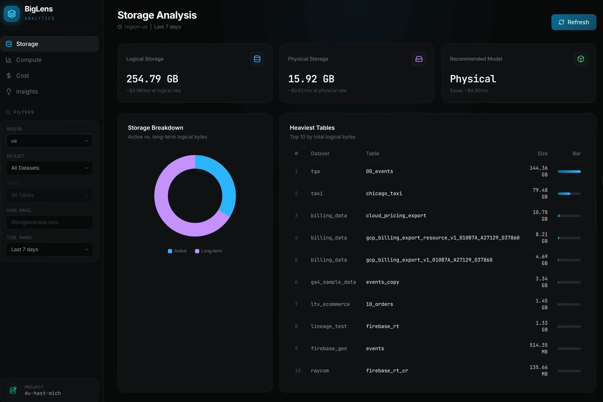
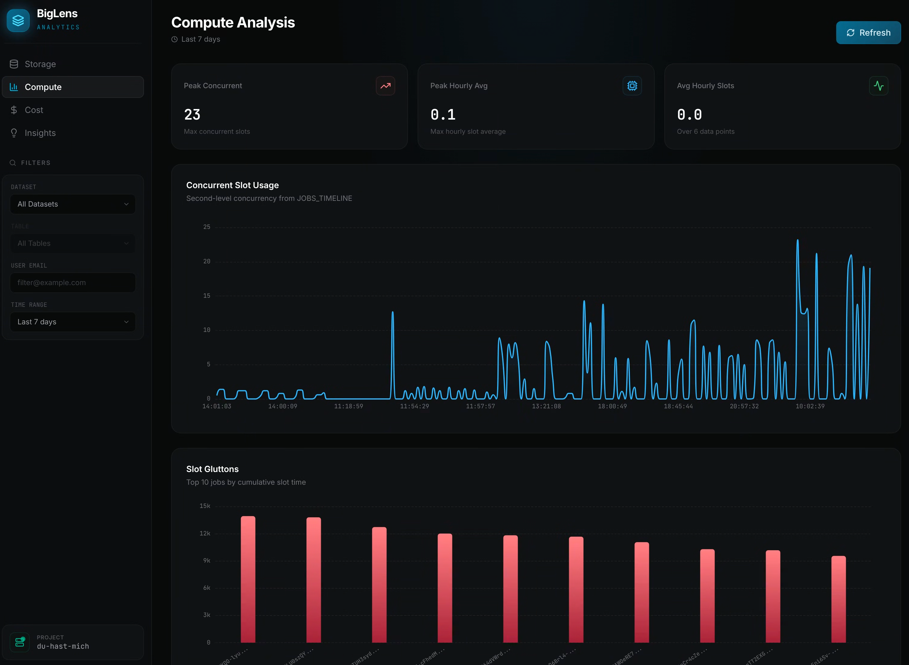
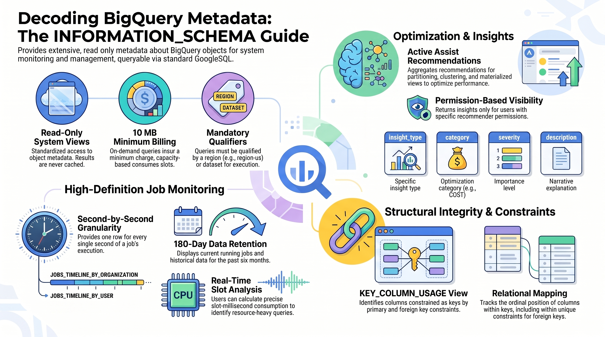

# BigLens

[](https://github.com/cloudymoma/biglens/actions/workflows/build.yml)

English | [简体中文](README_cn.md)

A real-time BigQuery observability dashboard. BigLens queries BigQuery's `INFORMATION_SCHEMA` views to surface storage costs, compute slot usage, per-user spend, and optimization recommendations — all from a single dark-themed web UI.





## Quick Start

### Prerequisites

- **Go 1.22+**
- **Node.js 20+** and npm
- **Google Cloud credentials** with BigQuery metadata access (`roles/bigquery.resourceViewer`)

### 1. Configure

Copy the template and fill in your GCP project ID:

```bash
cp conf.yaml.template conf.yaml
```

Edit `conf.yaml`:

```yaml
server:
  port: 1983
  mode: "debug"        # "debug" or "release"

bigquery:
  project_id: "your-gcp-project-id"
  credentials_path: "" # optional, falls back to GOOGLE_APPLICATION_CREDENTIALS
```

| Field | Description |
|---|---|
| `server.port` | HTTP port for the dashboard (default `1983`) |
| `server.mode` | `debug` for verbose logging, `release` for production |
| `bigquery.project_id` | Your GCP project ID |
| `bigquery.credentials_path` | Path to a service account JSON key. Leave empty to use Application Default Credentials (`gcloud auth application-default login`) |

### 2. Build & Launch

```bash
make serve
```

This single command:
1. Installs frontend dependencies and builds the React app
2. Copies the static bundle into the Go server
3. Compiles the Go binary
4. Starts the server

Open **http://localhost:1983** in your browser.

### Other Make Targets

```bash
make build-frontend   # Build only the React frontend
make build-backend    # Build only the Go binary
make build-all        # Build both without launching
make clean            # Remove build artifacts
```

### Development Mode

To run the frontend with hot reload while the backend serves API requests:

```bash
# Terminal 1: start the Go backend
make build-backend && ./bin/biglens-server

# Terminal 2: start Vite dev server (proxies /api/* to port 1983)
cd frontend && npm run dev
```

## Dashboards

BigLens provides four dashboard views, each powered by `INFORMATION_SCHEMA` queries:

| Dashboard | Widgets |
|---|---|
| **Storage** | Logical vs. physical billing simulator, active/long-term donut chart, top 10 heaviest tables |
| **Compute** | Concurrent slot usage area chart (JOBS_TIMELINE), top slot-consuming jobs |
| **Cost** | On-demand cost extrapolation ($6.25/TiB), spend-by-user treemap |
| **Insights** | Active BigQuery recommendations feed |

### Global Filters

All dashboards share a sidebar filter panel:

- **Region** — Searchable dropdown for the BQ region (defaults to `us`)
- **Dataset** / **Table** — Scope metrics to a specific dataset or table
- **User Email** — Isolate metrics to a specific user or service account
- **Time Range** — 24h, 7d, 30d, or 90d lookback

## Architecture

```
frontend/          React 19 + Vite + ECharts + Tailwind CSS v4
backend/           Go net/http server
  main.go          HTTP server, routing, middleware
  bigquery.go      All INFORMATION_SCHEMA queries
  handlers.go      Dashboard endpoints with errgroup concurrency
  cache.go         In-memory TTL cache (sync.Map, 10-min TTL)
  filters.go       Global filter parsing & SQL clause builders
  config.go        YAML config loader
```

The backend uses `errgroup` to run all widget queries for a dashboard in parallel, and caches results for 10 minutes to reduce BigQuery API calls.

## BigQuery INFORMATION_SCHEMA

BigLens is built entirely on BigQuery's `INFORMATION_SCHEMA` — a set of read-only system views that expose metadata about your BigQuery resources. These views provide storage metrics, job execution history, slot utilization, and optimization recommendations, all queryable with standard SQL.



For full documentation, see the official Google Cloud reference:
[BigQuery INFORMATION_SCHEMA Introduction](https://cloud.google.com/bigquery/docs/information-schema-intro)
