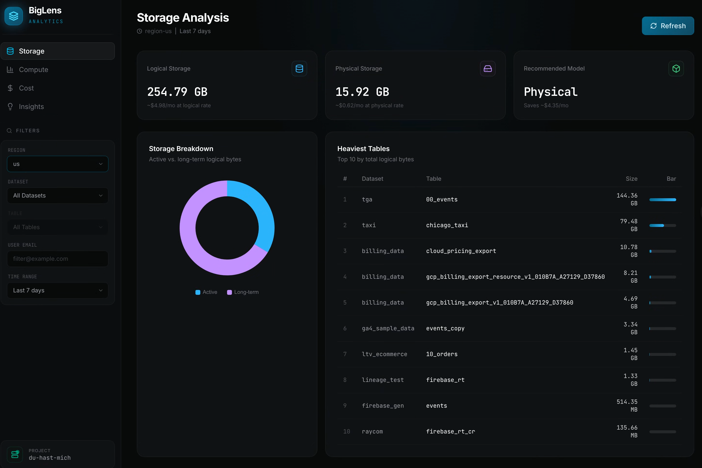
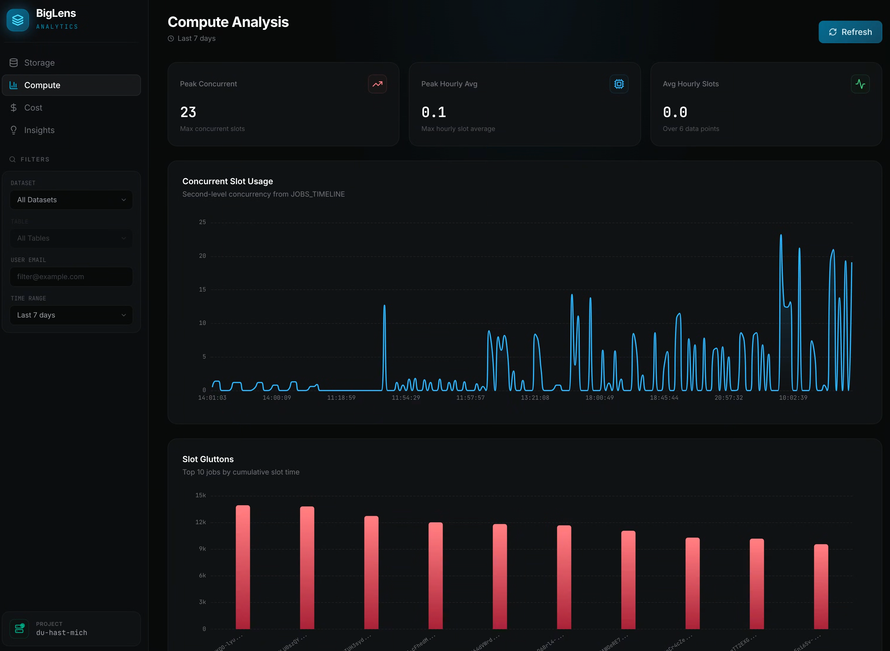
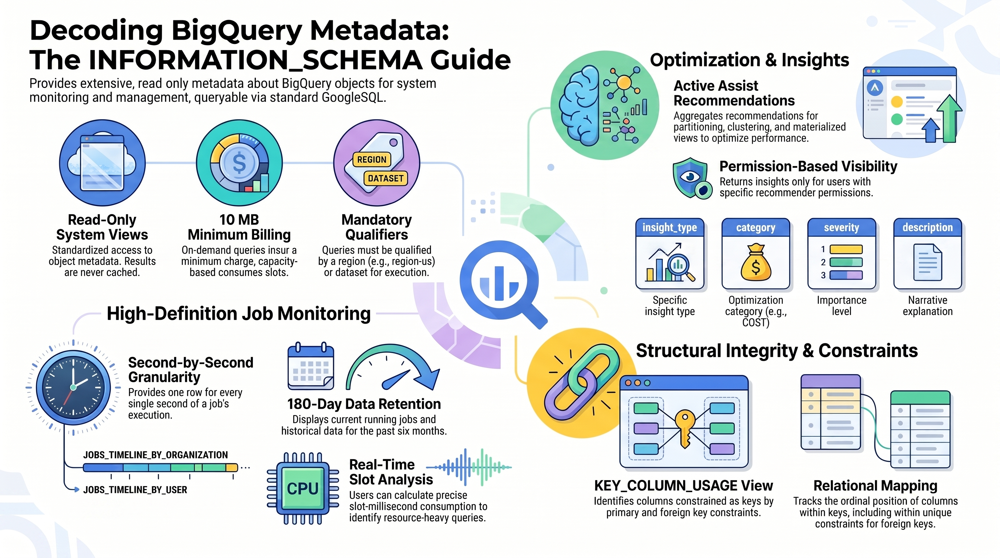

# BigLens

[](https://github.com/cloudymoma/biglens/actions/workflows/build.yml)

English | [简体中文](README_cn.md)

A real-time BigQuery observability dashboard. BigLens queries BigQuery's `INFORMATION_SCHEMA` views to surface storage costs, compute slot usage, per-user spend, and optimization recommendations — all from a single dark-themed web UI.





## Quick Start

### Prerequisites

- **Go 1.22+**
- **Node.js 20+** and npm
- **Google Cloud credentials** with BigQuery metadata access (`roles/bigquery.resourceViewer`; row-level security checks in Security Posture also need `bigquery.tables.list` and `bigquery.rowAccessPolicies.list`, e.g. `roles/iam.securityReviewer`)

### 1. Configure

Copy the template and fill in your GCP project ID:

```bash
cp conf.yaml.template conf.yaml
```

Edit `conf.yaml`:

```yaml
server:
  port: 1983
  mode: "debug"        # "debug" or "release"

bigquery:
  project_id: "your-gcp-project-id"
  credentials_path: "" # optional, falls back to GOOGLE_APPLICATION_CREDENTIALS
```

| Field | Description |
|---|---|
| `server.port` | HTTP port for the dashboard (default `1983`) |
| `server.mode` | `debug` for verbose logging, `release` for production |
| `bigquery.project_id` | Your GCP project ID |
| `bigquery.credentials_path` | Path to a service account JSON key. Leave empty to use Application Default Credentials (`gcloud auth application-default login`) |

### 2. Build & Launch

```bash
make serve
```

This single command:
1. Installs frontend dependencies and builds the React app
2. Copies the static bundle into the Go server
3. Compiles the Go binary
4. Starts the server

Open **http://localhost:1983** in your browser.

### Other Make Targets

```bash
make build-frontend   # Build only the React frontend
make build-backend    # Build only the Go binary
make build-all        # Build both without launching
make clean            # Remove build artifacts
```

### Development Mode

To run the frontend with hot reload while the backend serves API requests:

```bash
# Terminal 1: start the Go backend
make build-backend && ./bin/biglens-server

# Terminal 2: start Vite dev server (proxies /api/* to port 1983)
cd frontend && npm run dev
```

## Dashboards

BigLens provides five dashboard views, each powered by `INFORMATION_SCHEMA` queries:

| Dashboard | Widgets |
|---|---|
| **Storage** | Logical vs. physical billing simulator, active/long-term donut chart, top 10 heaviest tables |
| **Compute** | Slot usage over time from JOBS_TIMELINE (average slots per bucket — 1 min for 24h, 10 min for 7d, 1 h for 30d, 2 h for 90d — plus the busiest single second in each bucket), top slot-consuming jobs |
| **Cost** | On-demand cost extrapolation ($6.25/TiB), spend-by-user treemap |
| **Insights** | Active BigQuery recommendations feed |
| **IAM** | Per-principal job activity and inactive-principal detection (7/30/90-day windows) |

### Global Filters

All dashboards share a sidebar filter panel:

- **Region** — Searchable dropdown for the BQ region (defaults to `us`)
- **Dataset** / **Table** — Scope metrics to a specific dataset or table
- **User Email** — Isolate metrics to a specific user or service account
- **Time Range** — 24h, 7d, 30d, or 90d lookback

## Dataplex Knowledge Catalog

The **Dataplex** view turns your data catalog into an interactive 2D/3D graph
you can search, explore, and edit. It is built on the
[Open Knowledge Format (OKF)](https://github.com/GoogleCloudPlatform/knowledge-catalog/blob/main/okf/SPEC.md):
a git-friendly bundle of markdown files where each file is a *concept* (a node)
and markdown links between them are *edges*.

- **Graph** — force-directed, toggle between **2D** and **3D**. Nodes are
  colored by their `type` (BigQuery Table / View / Dataset, Glossary Term,
  Metric, …); edges are relationships.
- **Bottom tabs** — **Search** (by name, type, or tag), **Details** (frontmatter,
  body, and connections of the selected node), and **Edit** (create, update, or
  delete concepts — written straight to the markdown bundle).
- **Import from Dataplex** — pulls live entries from the Dataplex Universal
  Catalog (`SearchEntries`) into the OKF bundle and wires two kinds of edges:
  - **Containment** — `dataset ⊃ table`, derived from the entry hierarchy.
  - **Lineage** — source → derived table ETL data flow, from the
    [Data Lineage API](https://cloud.google.com/data-catalog/docs/concepts/about-data-lineage)
    (best-effort; if the API is disabled or untracked, import still succeeds
    with containment edges and reports lineage as skipped).
  Edits stay local in the bundle (reversible via git); they are **not** written
  back to Dataplex.

Configure the bundle and import source in `conf.yaml`:

```yaml
catalog:
  bundle_path: "okf-bundle"   # directory holding the OKF markdown bundle
  dataplex:
    project_id: ""            # defaults to bigquery.project_id when empty
    location: "global"        # Dataplex search location, e.g. "global" or "us"
  lineage_location: "us"      # Data Lineage API region (regional, not "global")
```

The runtime bundle `okf-bundle/` is git-ignored (it may hold imported
metadata). A reference sample ships in `okf-bundle.sample/` — copy it in to see
the graph before importing:

```bash
cp -r okf-bundle.sample/. okf-bundle/
```

Importing requires `roles/dataplex.catalogViewer`; lineage edges additionally
require the Data Lineage API enabled and `roles/datalineage.viewer`.

## BigQuery Open Data

The **BigQuery Open Data** view hosts dashboards built on
[Google Cloud public datasets](https://cloud.google.com/bigquery/public-data).
Queries run in your configured project (billed there) against
`bigquery-public-data`; every query filters on the partition key to keep scans
small, and results are served through the same 10-minute cache as the other
dashboards.

### Google Trends

The first dashboard, powered by `bigquery-public-data.google_trends`
(`international_top_terms` / `international_top_rising_terms` for Global mode,
plus `top_terms` / `top_rising_terms` for US Metro DMA mode):

| Widget | Description |
|---|---|
| **Top Terms Leaderboard** | Top 25 terms per country (or US DMA) with inline score bars |
| **Term Cloud** | Tag cloud sized by score, top-5 ranks highlighted |
| **Surging Terms** | Top 10 rising queries by `percent_gain`, plus a breakdown table |
| **Cross-Country / US Metro Interest** | A term's latest complete-week score across countries or US DMAs (unioned across top and rising tables) |
| **Interest Over Time** | 5-year weekly history (complete weeks only), compare up to 5 terms, drag to zoom |

Filters: market mode (**Global** country or **US Metro** DMA), snapshot date
(`refresh_date` partition discovered via `INFORMATION_SCHEMA.PARTITIONS`), and
a term search over the day's top/rising charts. Clicking any term focuses the
geographic view and adds it to the comparison chart.

#### Reading the numbers

The dashboard surfaces three metrics straight from the dataset — they measure
different things, so they don't move together:

- **Rank (1–25)** — the term's position in the country's (or US national)
  daily top chart, ordered by raw search volume for that snapshot. This is what
  sorts the leaderboard.
- **Score (0–100)** — Google's *relative* search-interest index for the
  snapshot's latest complete week (`DATE_ADD(week, INTERVAL 7 DAY) <=
  refresh_date`): each term is normalized against its own 5-year peak in that
  sub-region/DMA (`100` = peak week). Because the dataset reports `score` per
  sub-region/DMA and omits low-volume regions as `NULL`, BigLens averages across
  all sub-regions/DMAs with `NULL` treated as `0` and rounds to the nearest
  integer (`CAST(ROUND(COALESCE(AVG(IFNULL(score, 0)), 0)) AS INT64)`). The
  inline bar next to each leaderboard row visualizes this value.
- **Gain (%)** — for rising terms only: the week-over-week percentage increase
  in search volume (`percent_gain`). A brand-new breakout query can show gains
  of several thousand percent.

Because rank reflects *absolute daily volume* while score reflects *interest
relative to the term's own 5-year history*, a #14 term can score 100 (it just
hit its 5-year high) while the #1 term scores lower (huge volume, but past its
peak week). The leaderboard therefore intentionally sorts by rank, not score.

### GDELT News Pulse

A real-time global news sentiment and geopolitical monitoring dashboard,
powered by the [GDELT Project](https://www.gdeltproject.org/) 2.0 tables
`gdelt-bq.gdeltv2.events_partitioned`, `gdelt-bq.gdeltv2.gkg_partitioned`, and
`gdelt-bq.gdeltv2.eventmentions_partitioned`. GDELT machine-reads news media
worldwide in 100+ languages and refreshes every 15 minutes; BigLens queries the
partitioned tables directly (no intermediate tables or views).

| Tab | Widgets & Description |
|---|---|
| **Overview** | **Global Event Hotspots** (top 500 city/feature cells on a 0.1° grid where `ActionGeo_Type IN (3, 4)`), **Sentiment Gauge**, **Volume & Tone Trend**, **Cooperation vs Conflict** (QuadClass donut), **Risk Matrix** (Goldstein vs. activity), **Conflict Categories** (CAMEO root codes `'10'`–`'20'`), **Breaking Conflict Reports** (top 50 deduplicated by `SOURCEURL`), plus GKG **Trending Themes** (top 50), **Most Covered People** (top 20), and **Leading Media Sources** (top 10) |
| **Country & Relations** | **Global Tension Board** (top 30 bilateral CAMEO actor country pairs), country drill-down with **Daily Activity**, **What Is Happening** (top 15 full CAMEO codes), **Interaction Partners**, and **Biggest Stories** |
| **Human Impact** | GKG `V2Counts` coverage across 6 categories (`KILL`, `WOUND`, `ARREST`, `KIDNAP`, `DISPLACED`, `SEIZE`): **Daily Impact Reporting**, **Most Affected Countries** (FIPS 10-4 mapped to country names), and **Most Reported Incidents** |
| **Story Velocity** | Built from `eventmentions_partitioned` joined to `events_partitioned` (`Confidence >= 40`) for events first reported in the window: **Widest-Spreading Stories** (top 10 by distinct outlets) and **Story Board** (top 40 with mentions/hour velocity) |
| **Industry Pulse** | Curated GKG theme verticals across 11 industries (`finance`, `retail`, `biomedical`, `education`, `technology`, `transport`, `energy`, `agriculture`, `tourism`, `defense`, `realestate`): **Daily Pulse**, **Companies in the News**, **Sub-topics**, **Top Outlets**, and **Most Negative Articles** |

Filters: quick ranges (3 / 7 / 30 days) plus a custom UTC date range. Event
tabs accept up to **90 days**, GKG-backed panels/tabs up to **30 days**, and
Story Velocity up to **14 days**. Only the active tab fetches on range changes.

#### Understanding the data

GDELT is an index of *news coverage*, not a registry of verified incidents.
Each row is one machine-coded "who did what to whom" statement extracted from
a news report, so the same real-world incident covered by many outlets
produces many rows — counts measure **media attention**, which is exactly
what a news-pulse dashboard should show.

- **Date reported** — the UTC date GDELT ingested the report
  (`_PARTITIONDATE`), not the date the underlying event happened. This is the
  right axis for "what is the news covering right now", and it is also the
  table's partition key, so every query prunes to only the selected days.
  When the range includes today (UTC), the current day's bar is marked as
  `(partial)` since 15-minute batches are still arriving.
- **Country codes** — `ActionGeo_CountryCode` (Overview, Human Impact) uses
  2-letter **FIPS 10-4** codes (`GM` = Germany, `UK` = United Kingdom,
  `CH` = China, `SZ` = Switzerland, `RS` = Russia, `JA` = Japan, `KS` = South
  Korea, `AS` = Australia), which the UI translates to country names.
  `Actor1CountryCode` / `Actor2CountryCode` (Country & Relations) use 3-letter
  **CAMEO** sovereign country codes (regional/multi-country codes such as
  `EUR`, `AFR`, `WST` are excluded).
- **Tone** — the average emotional tone of the language in the articles
  describing an event, from GDELT's sentiment engine. The scale is
  −100…+100 but real-world values almost always fall in −10…+10; below −2
  reads as clearly negative coverage, above +2 as positive.
- **Goldstein scale (−10…+10)** — a standard political-science score of an
  event *type*'s theoretical impact on a country's stability (e.g. "Provide
  aid" is strongly positive, "Fight" strongly negative). It is fixed per
  CAMEO event type — it rates the kind of action, not the individual article.
- **QuadClass (1–4)** — GDELT's coarsest event grouping: Verbal Cooperation,
  Material Cooperation, Verbal Conflict, Material Conflict. Classes 3–4 drive
  the "Conflict Share" metric and the breaking-reports list.
- **CAMEO root codes ('01'–'20')** — the 20 top-level event categories of the
  [CAMEO taxonomy](http://data.gdeltproject.org/documentation/CAMEO.Manual.1.1b3.pdf)
  (Appeal, Consult, Threaten, Protest, Fight, …). Codes '10'+ are the
  conflict side. The API returns raw codes; the UI maps them to labels.
- **Mentions (1st batch)** — `NumMentions` and `NumSources` on `events_partitioned`
  record how many times an event was mentioned in the **initial 15-minute batch**
  when the event was first extracted. For full cross-batch propagation across
  subsequent 15-minute intervals, use the **Story Velocity** tab (which queries
  `eventmentions_partitioned`).
- **Themes / People (GKG)** — from the Global Knowledge Graph, which tags
  every *article* with themes (e.g. `PROTEST`, `WB_2670_JOBS`) and named
  people. Their weights are **article counts**: an article mentioning a theme
  ten times still counts once, so long articles don't dominate the treemap.
- **Media source tone** — the average document tone (first field of the GKG
  `V2Tone` composite) across everything an outlet published in the range.

#### How the numbers are calculated

- **Weighted averages, never averages of averages.** BigQuery returns one
  row per (day × QuadClass × event type) group with that group's `AVG` and
  `COUNT`; the Go backend combines them as `Σ(avg×n)/Σ(n)`, which is
  mathematically identical to averaging the raw rows. A plain mean of group
  averages would let a 10-event group distort the global tone as much as a
  100,000-event group.
- **Hotspots** filter to city/landmark coordinates (`ActionGeo_Type IN (3, 4)`),
  excluding country/state geographic centroids (`ActionGeo_Type IN (1, 2, 5)`)
  and `(0, 0)`, rounded to a 0.1° grid (~11 km) and aggregated per cell.
- **Breaking reports** are deduplicated by `SOURCEURL` (keeping each
  article's highest-mention event row), because GDELT emits several event
  rows per article and one big story would otherwise flood the top 50.
- **Cost guardrails**: native `DATE` parameters against `_PARTITIONTIME`,
  single-scan consolidated `ARRAY(SELECT AS STRUCT ...)` queries per endpoint,
  hard span caps (90 / 30 / 14 days), `MaximumBytesBilled` caps (4 GiB for
  Events, 16 GiB for GKG), 10-minute live / 24-hour historical caching, and
  request coalescing (`singleflight`) with detached contexts. On the default
  3-day window, a cold cache miss on Overview scans ~48 MB for Events and
  ~676 MB for GKG (~724 MB total, under half a cent at on-demand pricing).

### Global Weather

Daily land-station observations from NOAA GHCN-Daily
(`bigquery-public-data.ghcn_d`): ~20,000 active stations worldwide (~6,000
reporting `TMAX` on a settled day).

| Widget | Description |
|---|---|
| **KPI strip** | Stations reporting, hottest / coldest / wettest station, stations with snow |
| **Station Map** | World map of the snapshot day's observations (max/min temp, precipitation, snow) |
| **Daily Trend** | Network-wide temperature/precipitation averages and reporting-station counts |

Filters: snapshot date (back to 1900) and a 7–31 day trailing window. Trend
averages are means across reporting stations — a network mean, not a
physical global average. Because NOAA stations backfill over ~3–5 days and the
BigQuery public table syncs periodically, the default date automatically selects
the freshest day with settled coverage (≥3,000 `TMAX` stations) and shades the
provisional 4-day tail on the trend chart.

### Crypto Pulse

On-chain financial fundamentals and live payment/risk telemetry across Bitcoin,
Ethereum, Arbitrum, Optimism, Base, Polygon, TRON and Solana, powered by
`bigquery-public-data.crypto_bitcoin`, `crypto_ethereum` and `goog_blockchain_*`
(near-real-time public tables, typically lagging chain head by a few minutes;
daily analytical endpoints align to settled complete UTC days) plus live public
RPCs and indexers. Seven lazily-loaded tabs:

| Tab | Widgets |
|---|---|
| **Network Pulse** | Per-chain KPI strip (latest complete UTC day), daily transactions, value settled, active addresses (approx. distinct senders, ≤90d), block fullness, block production |
| **Fee Market** | **72h Gas Pulse** (default): last 72 complete UTC hours for Bitcoin, Ethereum, Arbitrum, Optimism, Polygon, TRON and Solana — hourly fee band + load chart, latest-hour 72h percentile, 72h low/high/median, all-time base-fee records (incremental BigQuery scan from a pre-seeded baseline, refreshed daily) and TRON energy price history (TronGrid). Selecting Bitcoin or TRON adds a live bar refreshed every 30s (paused while the tab is hidden): BTC precise fee tiers (sub-1 sat/vB, USD per 140 vB transfer) and mempool backlog by fee band (mempool.space), or the TRX burned by a USDT transfer to an existing vs. new address (TronGrid prices, Coinbase spot). The Bitcoin bar also shows a block conveyor (next three projected blocks vs. the five latest mined), and selecting Ethereum, Arbitrum or Optimism shows an L1-vs-L2 ladder: full cost of an ETH and a USDC transfer on Ethereum, Arbitrum One, Optimism and Base — L2 execution plus unpadded L1 data fee (GasPriceOracle / NodeInterface) — with USD and savings vs. L1. Transfer profiles are measured daily rather than assumed — USDT energy and bandwidth from the last 24h of TRON transfers (BigQuery + TronGrid), USDC transfer gas as the 6h median on Ethereum — and every endpoint can be overridden in an optional `crypto_gas` section of `conf.yaml` (Ethereum RPCs are tried in order). **Daily Economics**: BTC median sat/vB vs ETH avg gwei trend, BTC miner revenue (subsidy vs fees), ETH EIP-1559 burned vs tips, congestion-vs-fee scatter |
| **Whales & Flow** | Top 50 largest transfers (explorer links), whale-sized tx trend (≥100 BTC / ≥1,000 ETH), top receiving addresses, top-1% value concentration (among value-bearing txs) |
| **Token Economy** | Top 25 token contracts by Transfer event count (ERC-20 & ERC-721), token vs native activity, new contract deployments, token movement treemap |
| **Mining Economics** | Network hashrate (7d avg + 1d implied), miner revenue, yield per TH/s, rig economics for the latest day, shutdown price by rig (editable electricity, PUE, pool fee, BTC price, custom rig) |
| **Payment Check** | Live receiving-address verification for USDT, USDC, ETH, TRX, BTC and SOL across Ethereum, Arbitrum, Optimism, Base, TRON, Bitcoin and Solana — finality-graded balances, latest incoming settlement progress (`DANGER` / `SOFT` / `SAFE` → `FINALIZED`), official vs. bridged/counterfeit token verification, 7-day transfer history with address-poisoning & BIP-125 RBF detection, and independent payer risk screening — see [Payment Check](#payment-check-receiving-address-verification) below |
| **Address Risk** | Multi-chain address risk-clue lookup (Ethereum, Arbitrum, Optimism, Base, TRON, Bitcoin, Solana), live issuer & SPL freeze checks, freeze-history overview, **Scam Radar** (30-day ETH/TRON address-poisoning & fake-token intelligence, top counterfeit contracts, BTC explicit RBF share), and sources table — see [Address Risk](#address-risk-multi-chain-address-risk-clues) below |

Ranges: 7/30/90 days everywhere, plus 1 year for the slim aggregate trends
(pulse, fees, mining); token queries cap at 30 days. Daily endpoints align their
window to settled UTC days (with a 20-minute post-midnight ingest buffer) and
cache results until the next UTC day rollover. Every query bounds the timestamp
window — `crypto_bitcoin.transactions` and `crypto_ethereum.transactions` /
`token_transfers` prune daily on `block_timestamp`, while `crypto_ethereum.blocks`
and `contracts` include a conservative post-Merge block-number lower bound
(`number >= @start_block` / `block_number >= @start_block`) alongside the exact
timestamp window, and every query sets `MaxBytesBilled`.

#### Understanding the data

These datasets contain **on-chain data only — no fiat prices**. Everything is
reported in native units (BTC, ETH, gwei) or counts:

- **Value settled (BTC)** sums transaction outputs, which include change
  returning to the sender — an upper bound on economic volume, not a measure
  of "money changing hands". On Ethereum, value settled sums succeeded top-level
  transaction `value` (`receipt_status = 1`, excluding internal contract
  transfers). The panel note carries the same caveat.
- **Active addresses** are approximate distinct senders per day
  (`APPROX_COUNT_DISTINCT`, ~1% error) — a network-activity gauge, not a
  user count (one user can hold many addresses).
- **Token activity is measured in Transfer event counts, never summed values**:
  cross-token value sums are meaningless without prices, and the `decimals`
  metadata needed to scale raw amounts is unreliable for long-tail tokens.
- **Whale thresholds** (≥100 BTC, ≥1,000 ETH) are named constants in native
  units; there is no USD equivalent in the datasets.

#### Payment Check (receiving address verification)

Paste your own receiving address to verify incoming payments across **USDT** (`tron`, `eth`, `arb`, `op`, `base`, `sol`),
**USDC** (`eth`, `arb`, `op`, `base`, `sol`), **ETH** (`eth`, `arb`, `op`, `base`), **TRX** (`tron`), **BTC** (`btc`),
and **SOL** (`sol`):

- **Three-tier finality & balance breakdown** — EVM chains read `finalized`, `safe` and `latest` heads concurrently
  (clamped monotonically so node skew never inverts order) and report balances as **Finalized**, **Safe, not final**
  (`safe − finalized`) and **Latest only** (`latest − safe`). Bitcoin reads Esplora tip height (`mempool.space` with
  `blockstream.info` fallback), classifies unconfirmed mempool outputs (`0 confirmations`) as `DANGER` (highlighting
  full-RBF double-spend risk and explicit BIP-125 `rbf_signaled`), `1–2 conf` as `SOFT`, `3–5 conf` as `SAFE`, and
  `≥6 conf` as `FINALIZED`. Solana samples `finalized`, `confirmed` and `processed` slots plus native/SPL balances at
  each commitment level without batch RPC calls. TRON reads `/walletsolidity` vs `/wallet` and reports **Solidified** and
  **Unconfirmed** (`latest − solidified`). `FINALIZED` stablecoin cards always note that issuer contracts / freeze
  authorities (Tether / Circle) can still freeze tokens on-chain.
- **Token contract & mint registry (`native` / `bridged` / `counterfeit` / `other`)** — hard-coded registry in
  `backend/chain_registry.go` covering EVM, TRON and Solana (`Es9vMFrzaCERmJfrF4H2FYD4KCoNkY11McCe8BenwNYB` for USDT,
  `EPjFWdd5AufqSSqeM2qN1xzybapC8G4wEGGkZwyTDt1v` for USDC). Bridged tokens (`USDC.e` on Arbitrum/Optimism, legacy bridged
  `USDT` on Optimism and Base) are shown with an explicit warning; unrecognised EVM/TRON contracts or Solana Metaplex
  mints whose symbol normalises to `USDT`/`USDC`/`USD₮` (or whose contract address is in the local `scam_fake_tokens`
  database on Ethereum) are flagged as `counterfeit_token`.
- **7-day transfer history, UTXO/ATA owner resolution & poisoning detection** — merges recent RPC logs, Esplora UTXO
  pages (`mempool.space`), or Solana `getSignaturesForAddress` + `maxSupportedTransactionVersion: 1` transaction parses
  (resolving SPL Associated Token Accounts back to wallet owners so 0-value poisoning transfers attribute the attacker's
  wallet rather than token account). Scans chronologically (with 0-confirmation mempool transfers ordered last so they
  never enter trusted counterparty history) to flag `zero_value`, `dust`, `rbf_signaled`, `lookalike` (matching both first
  4 and last 4 characters — stripping `0x` on EVM and `bc1q`/`bc1p` on SegWit/Taproot BTC), `lookalike_known`,
  `sent_to_lookalike`, `counterfeit_token`, `failed` and `counterparty_listed`. The default "Hide zero-value & unrelated
  tokens" filter hides benign noise while never hiding `DANGER`, `rbf_signaled`, or any row carrying a risk flag.
- **Independent payer screening** — when the latest incoming transfer's `tx_hash` changes, the payer address is
  checked once through Address Risk (`lookup`) without re-polling on every 5-second settlement tick. Queried
  receiving addresses stay in the URL hash (`#pay?asset=…&network=…&address=…`) and short-lived in-memory caches only.

#### Address Risk (multi-chain address risk clues)

Select a chain (**Ethereum**, **Arbitrum**, **Optimism**, **Base**, **TRON**, **Bitcoin**, or **Solana**) and paste an
address to see **risk clues** grouped as Critical / Warning / Association / Info. BigLens never labels an address "safe":
when nothing is found it says how many sources were checked and which could not be.

| Source | Chains covered | How | Sends the address to a third party? |
|---|---|---|---|
| OFAC SDN (via [0xB10C](https://github.com/0xB10C/ofac-sanctioned-digital-currency-addresses), MIT) | ETH, Arb, OP, Base, TRON, BTC, SOL | synced every 6 h into local SQLite (`ETH`, `TRX`, `XBT`, `SOL`, plus TRON/Solana entries in `USDT`/`USDC`) | No |
| [MEW darklist](https://github.com/MyEtherWallet/ethereum-lists) (MIT; historical list, frozen since 2020-11) | ETH, Arb, OP, Base | synced every 6 h into local SQLite | No |
| USDT / USDC freeze, unfreeze and destroy events (`crypto_ethereum.logs`) | ETH | synced from BigQuery by complete UTC day | No |
| TRON USDT freeze, unfreeze and destroy events (`goog_blockchain_tron_mainnet_us.logs`) | TRON | synced from BigQuery by complete UTC day (`tron_stablecoin`) | No |
| Known address-poisoning lookalike corpus (`scam_lookalikes`) | ETH, Arb, OP, Base, TRON | synced from BigQuery by complete UTC day (ETH zero-value + TRON dust poisoning; EVM EOAs shared across L1/L2) | No |
| **Issuer freeze (live)** (`isBlackListed` / `isBlacklisted` / `isBlocked` / SPL account freeze state) | ETH, Arb, OP, Base, TRON, SOL | live `eth_call` / TronGrid `triggerconstantcontract` / Solana `getMultipleAccounts` against registered USDT / USDC contracts & ATAs | Yes — the RPC / TronGrid / Solana RPC provider |
| Chainalysis sanctions oracle (on-chain `isSanctioned`) | ETH, Arb, OP | live `eth_call` via public RPCs (not deployed on Base) | Yes — the RPC provider |
| [GoPlus](https://gopluslabs.io) address security | ETH, Arb, OP, Base, TRON, SOL | live, keyless (`chain_id` `1` / `42161` / `10` / `8453` / `tron` / `solana`) | Yes — GoPlus |
| Blockscout public tags & scam badge | ETH, Arb, OP, Base | live, keyless (`eth` / `arbitrum` / `optimism` / `base` Blockscout instances) | Yes — Blockscout |
| Etherscan / Blockscout association analysis (optional free key on ETH) | ETH | live `txlist` / `tokentx` / `txlistinternal`, 1 hop, poisoning-filtered | Yes — Etherscan (with your key) or Blockscout |

Local data lives in `data/security.db` (relative to the working directory; override with `address_risk.db_path`).
If the file cannot be opened the server still starts and lookups report the local lists as unavailable.
Looked-up addresses are kept only in the 10-minute in-memory cache — never written to disk or logs.

**Freeze history (BigQuery).** On first start the server syncs the last 30 days of Ethereum USDT/USDC freeze events
(~110–130 GB scanned, ~$0.6–$0.8 once), then one new day per day (~3.5–4.5 GB for the logs scan plus ~25 MB for the
partitioned completeness check, ~$0.02–$0.03/day). `address_risk.initial_sync_days`
changes the window (0 disables it, max 31). Until the full history is backfilled, lookups say
"Freeze history covers … only". In addition to the local Ethereum and TRON event histories, every lookup on ETH, Arbitrum,
Optimism, Base and TRON runs a live `issuer_freeze` contract call so current freeze state is checked even before
backfill completes. The Ethereum backfill is safe to run while the server runs:

```bash
cd /opt/biglens/backend && sudo -u biglens ./biglens-server --address-risk-backfill        # dry run: per-year cost (~25 MB watermark check, no backfill batches run)
cd /opt/biglens/backend && sudo -u biglens ./biglens-server --address-risk-backfill --yes  # full history since 2017-11-28: ~3.4 TB, ~$20
```

`cd` is required (conf.yaml, `logs/` and `data/` are relative to the working directory), and so is
`sudo -u biglens` (otherwise the database files become root-owned and the service cannot write them).
`--since YYYY-MM-DD` limits the range; `--since-days N` is for development only. A failed run resumes where it stopped.

**Scam Radar (BigQuery daily intelligence).** Below the freeze-history KPIs in the Address Risk overview, **Scam Radar**
tracks four daily BigQuery intelligence feeds and feeds them back into Address Risk lookups, Payment Check, and Whales & Flow:

- **ETH zero-value address poisoning (`scam_eth` / R1)** — scans `goog_blockchain_ethereum_mainnet_us.token_transfers` on
  official USDT and USDC for zero-value transfers whose recipient matches the first 4 and last 4 hex characters of a
  real recipient that the same victim paid on the **same UTC day**.
- **ETH counterfeit USDT/USDC contracts (`scam_eth` / R2)** — joins `token_transfers` against `crypto_ethereum.tokens`
  for non-official contracts whose symbol matches `^(USDT|USDC|USD₮)[^A-Z0-9]?$`, ranking the top 10 most active fake
  contracts over the last 7 days and feeding `scam_fake_tokens` into Payment Check.
- **TRON USDT dust poisoning (`scam_tron` / R3)** — scans `goog_blockchain_tron_mainnet_us.logs` on official TRON USDT
  (`TR7NHqjeKQxGTCi8q8ZY4pL8otSzgjLj6t`) for dust transfers (`< 0x100000` smallest units, ~1.05 USDT — both incoming dust
  from a lookalike and forged/dust outgoing transfers to a lookalike) paired with real transfers on the **same UTC day**,
  computing Base58Check 4+4 prefix/suffix matches directly inside BigQuery.
- **TRON USDT freeze events (`tron_stablecoin_logs` / R4)** — syncs `AddedBlackList`, `RemovedBlackList` and
  `DestroyedBlackFunds` logs on TRON USDT into `tron_stablecoin_events`, powering the **USDT frozen now (TRON)** KPI card
  and the `tron_stablecoin` lookup source.
- **BTC explicit RBF share (`scam_btc` / R5)** — computes the daily share of Bitcoin transactions with at least one input
  signaling BIP-125 Replace-By-Fee (`sequence < 0xfffffffe`) from `crypto_bitcoin.inputs`, reinforcing why 0-confirmation
  BTC transfers are never treated as settled.
- **Lower-bound methodology & cost** — because R1 and R3 only pair zero-value/dust transfers against real transfers within
  the **same UTC day**, cross-day poisoning (where a victim transacts on day $T$ and is poisoned days later) is not
  counted; reported poisoning hits and lookalike counts are therefore a **lower bound**. Scam Radar is enabled by default
  (`address_risk.scam_radar.initial_days: 30`, `retention_days: 90`; set `initial_days: 0` to disable). The 30-day cold
  start scans ~150–160 GB (~$0.95–$1.00 once, with `crypto_ethereum.tokens` scanned once across the window), and
  subsequent daily syncs scan ~5.3 GB/day (~$0.033/day, ~$1/month at $6.25/TiB).

**Etherscan key (optional).** With a free Etherscan API key (https://etherscan.io/myapikey) an Ethereum lookup also checks the
address's newest 1000 transactions, token transfers (12 allowlisted tokens: USDT/USDC/DAI/WETH/WBTC/stETH/wstETH/USDS/USDe/PYUSD/FDUSD/cbBTC) and internal transfers against the
local lists, one hop deep (falling back to Blockscout when no key is configured). Zero-value transfers, failed calls and counterfeit tokens are ignored (address poisoning).
Set the key in the Address Risk tab: it is checked with Etherscan, then saved to `conf.yaml`, which is rewritten
with mode 0600 (a hand-edited conf.yaml keeps its mode until the first save from the UI). Only the last 4 characters
are ever shown, and the key is never logged. Etherscan's API terms allow personal, non-commercial use only
(https://etherscan.io/apiterms): configure a key only on an instance you use alone.

In **Whales & Flow** (BTC & ETH), addresses on the local lists carry `OFAC` / `Frozen` / `MEW` / `Lookalike` badges (with a coverage note when local freeze history is partial), and clicking an
ETH address opens it in Address Risk.

### SEM Insights

A keyword-arbitrage dashboard for search-engine marketers, combining the
Google Trends daily tables (`bigquery-public-data.google_trends`), the hourly
US table (`google_trends_hourly.top_terms_hourly`) and GDELT news tone
(`gdelt-bq.gdeltv2`). It is organized around four SEM decisions: **what to
bid on, where to bid, when to bid, and when *not* to bid.**

The core idea: the day's *rising* queries are joined against the *top-25*
chart of the same snapshot. A term that is surging but not yet charting has
momentum before mainstream volume — which usually means Keyword Planner
hasn't repriced it and CPCs are still low. That window is the arbitrage.

| Widget | Description |
|---|---|
| **Breakout Keyword Matrix** | Bubble chart of rising terms: velocity (week-over-week gain, log scale) vs mainstream volume rank. The far-left **Unranked** band + amber bubbles are the arbitrage zone. Click a bubble to drill down |
| **Geo Interest** | The selected term's score in each of the 210 US DMAs (or a country's regions) for the snapshot's latest complete week — indexed to each geo's own 5-year peak, so not comparable across geos; geos without a reported score show as *insufficient data* |
| **Brand Safety & Tone Radar** | 14 days of GDELT news tone + conflict-event share for the market, rolled into a 🟢/🟡/🔴 banner with a plain-language SEM action |
| **Keyword Opportunities** | The actionable table — respects all filters, exports one-click Google Ads Editor CSVs (keywords + checked-row negatives) |
| **US Real-Time Pulse** | US mode only: the latest intraday snapshot from the hourly table (~4×/day, hours ahead of the 1–2-day-lagged daily tables) |
| **Term Drill-Down** | Opens on any term click: ~5-year weekly seasonality with a same-week-last-year marker, last-8-week momentum bars, and on-demand news-cycle context |

Controls: market toggle (**Global** — 42 countries at region grain / **US
Metro** — 210 Nielsen DMAs), a searchable geo selector, snapshot date picker,
a velocity slider (client-side filter, +50%…+5000%, log scale), and a
brand-safety overlay toggle.

#### Reading the numbers

Each column measures a different thing; the interesting keywords are the ones
where the columns *disagree* (high gain, no rank):

- **Gain (%)** — week-over-week growth in search volume (`percent_gain`,
  rising tables only). Brand-new breakouts routinely show +1,000% or more.
  This is the momentum axis of the matrix and the default sort of the table.
- **Volume rank** — the term's position in the same snapshot's top-25 chart.
  **UNRANKED** means it is not charting anywhere in the selected geo's top 25
  — that is the buy signal, not missing data: demand is accelerating but has
  not reached the mainstream volume that drives auction competition.
- **Score (0–100)** — Google's relative interest index for the snapshot's
  latest complete week, normalized against the term's own 5-year peak (bubble
  size in the matrix) and averaged across all sub-regions/DMAs with `NULL`
  treated as `0`. A **low vol** badge means no sub-region reported a positive
  score in that week.
- **Geo spread (Active DMAs / Regions)** — in how many DMAs/regions the term
  has a non-null `score` in the latest complete week: distinguishes a broad
  breakout (bid broadly) from a local phenomenon (bid with geo targeting).
- **Geo Interest score** — the term's score in each DMA/region for the
  snapshot's latest *complete* week (the US tables also carry the week that
  starts on the snapshot day, where most DMAs have no score yet, so it is
  skipped). Every geo is indexed to its own 5-year peak (100 = the term's
  local high), so a score says how close the term is to its peak *there*, not
  how much demand the geo has: scores are not comparable across geos and no
  bid adjustment is suggested. The panel names the week, how many geos have
  data, and the national/country rising rank badge; geos with no reported score
  show as *insufficient data*, are listed last and are left out of the chart.
- **Safety banner** — event-weighted 3-day average of GDELT news tone and
  conflict share for the market compared against both absolute thresholds and
  the country's 14-day baseline. The signal is country-grained (US-national in
  DMA mode), so with the overlay on, *every* matrix bubble is tinted and the
  table header carries one chip — it is market context, not per-keyword
  sentiment. On red: review broad match, consider pausing brand-adjacent
  trend bids, and use the checkboxes to build the negatives export.
- **Pulse Δ badge (wow)** — the current *partial* week's score vs last week
  (averaged across all 210 DMAs with `NULL` treated as `0`), computed from the
  hourly snapshot's own weekly history (▲ accelerating, ▼ fading, **new** = no
  measurable interest last week, i.e. `prev_week_score = 0`). Consecutive
  hourly snapshots carry fully disjoint top-25 sets, so there is deliberately
  no "rank vs 6 hours ago" — that comparison does not exist in the data.
- **CSV exports** — Google Ads Editor import format. Keywords CSV ships every
  visible row with Campaign `SEM-Trends-{date}`, Ad group = the selected geo,
  match type Phrase, and Max CPC left blank (that decision stays yours);
  Negatives CSV ships only the rows you checked.

A practical pass: pick market + geo → scan the matrix top-left (unranked,
high-gain, sizable bubbles) → click one to check its geo interest and
seasonality → glance at the safety banner → export the keywords CSV and the
checked negatives.

Known limits (also stated in the UI): scores are relative, not absolute
volume; there is no CPC or competition data — this complements Keyword
Planner rather than replacing it; hourly + DMA granularity is US-only; the
daily snapshots lag 1–2 days (the pulse widget exists to close that gap).

### Adding another public dataset

1. Backend: create `backend/opendata_<name>.go` (typed rows + `BQClient`
   methods) and `backend/opendata_<name>_handlers.go`, routed under
   `/api/opendata/<name>/*`.
2. Frontend: build the dashboard component in `frontend/src/opendata/` and
   register it in `frontend/src/opendata/registry.tsx` — the sidebar entry,
   header, and routing come for free.

## Trends & GDELT Conversational Agent (Standalone)

Beyond the dashboards, this repo ships [`trend_gdelt_bot/`](trend_gdelt_bot/README.md) —
an independent, self-contained package for building a **Conversational Analytics
agent in BigQuery** over the same Google Trends and GDELT 2.0 public datasets.
It includes a curated SQL semantic layer (FIPS→ISO country mapping, latest-week
pinned views, a unified trends × news mart), a BigQuery property graph, an OKF
knowledge bundle for agent grounding, an idempotent one-shot `init.sh` deployment
script, and a step-by-step BigQuery Console tutorial. It only needs `gcloud`/`bq` —
it does not depend on the BigLens server.

See the [trend_gdelt_bot guide](trend_gdelt_bot/README.md)
([简体中文](trend_gdelt_bot/README_cn.md)).

## Architecture

```
frontend/            React 19 + Vite + ECharts + Tailwind CSS v4
  catalog/           Dataplex graph view (react-force-graph 2D/3D, three.js)
backend/             Go net/http server
  main.go            HTTP server, routing, middleware
  bigquery.go        All INFORMATION_SCHEMA queries
  handlers.go        Dashboard endpoints with errgroup concurrency
  catalog_handlers.go  OKF graph/search/concept/import endpoints
  okf.go             OKF bundle engine (parse, graph, read/write concepts)
  catalog_dataplex.go  Dataplex SearchEntries -> OKF concept mapping
  cache.go           In-memory TTL cache (sync.Map, 10-min TTL)
  filters.go         Global filter parsing & SQL clause builders
  config.go          YAML config loader
```

The backend uses `errgroup` to run all widget queries for a dashboard in parallel, and caches results for 10 minutes to reduce BigQuery API calls.

## BigQuery INFORMATION_SCHEMA

BigLens is built entirely on BigQuery's `INFORMATION_SCHEMA` — a set of read-only system views that expose metadata about your BigQuery resources. These views provide storage metrics, job execution history, slot utilization, and optimization recommendations, all queryable with standard SQL.



For full documentation, see the official Google Cloud reference:
[BigQuery INFORMATION_SCHEMA Introduction](https://cloud.google.com/bigquery/docs/information-schema-intro)

## License

BigLens is source-available under **The Bindiego License (BDL) 1.0** — see [LICENSE](LICENSE). It permits academic
use (including personal study) and contributions to the official repository, `github.com/cloudymoma/biglens`;
all commercial use requires a separate license from the author. Third-party components keep their own licenses.
